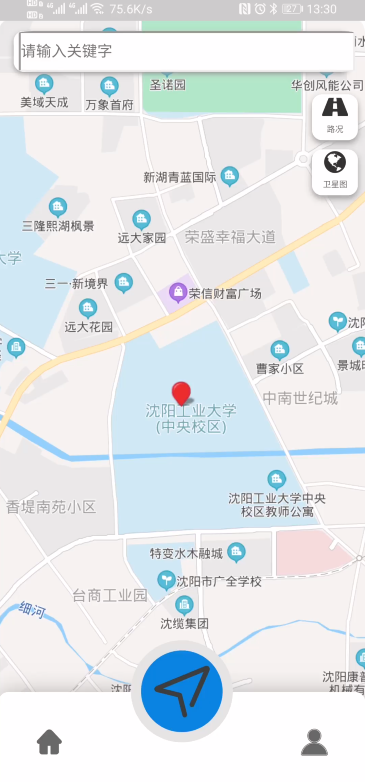

# 地图导航App——MiniMap(微图)
## 实现功能
- 地图展示
- 定位
- 图层修改(交通图层、卫星图层)
- 周边地点推荐
- 单击地图展示信息
- 用户模块(后端Springboot管理)
- 模糊搜索定位地点
- 路线规划
## 开发工具
- HBuilderX
## 框架
- MUI
## 项目搭建
- 项目clone至本地，用HBuilderX导入
- 在百度地图开放平台申请key，并替换map.html和routemap.html中引入的百度API中的key
- 可在真机/手机模拟器上运行，真机运行使用usb连接手机，开启usb调试
- 若要连接后端，需将js/app.js中的serverUrl的IP替换为自己的IP
## 运行截图

## 后端项目地址

